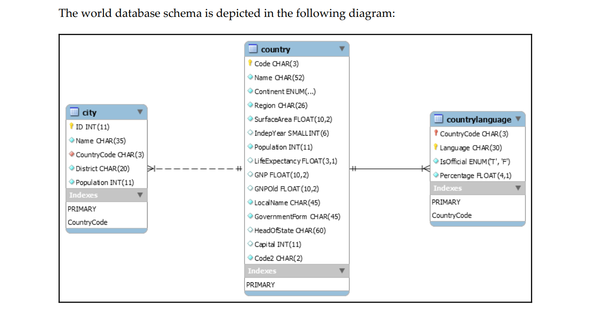
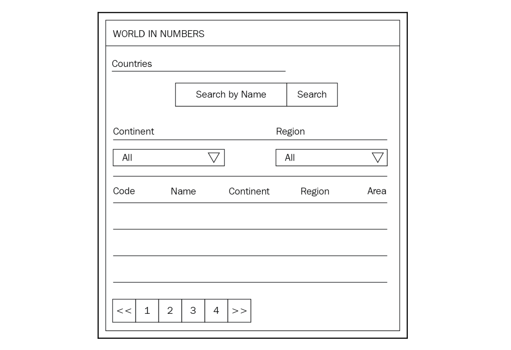
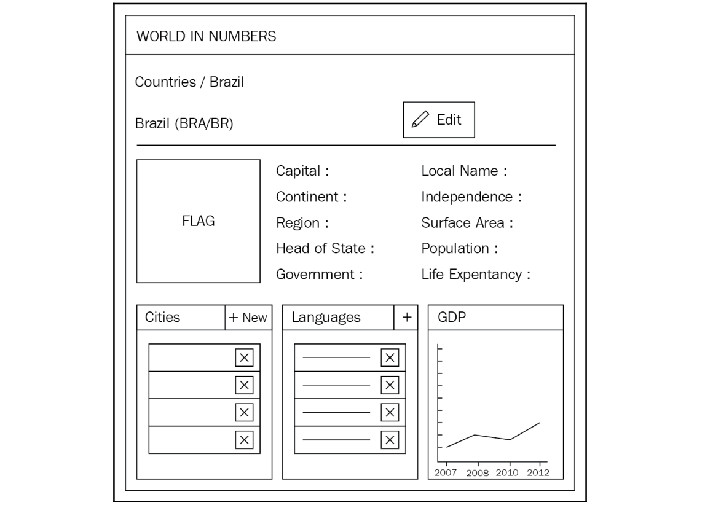
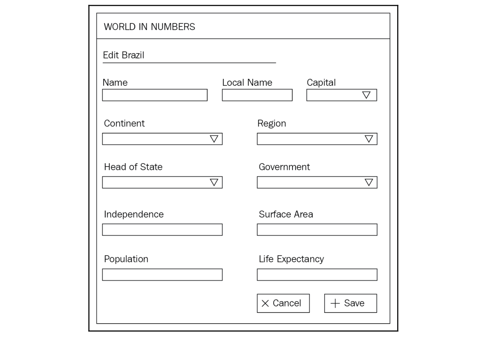
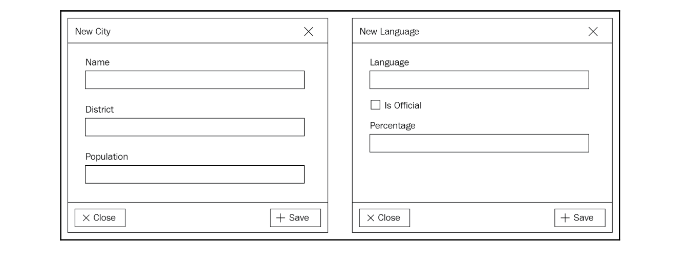
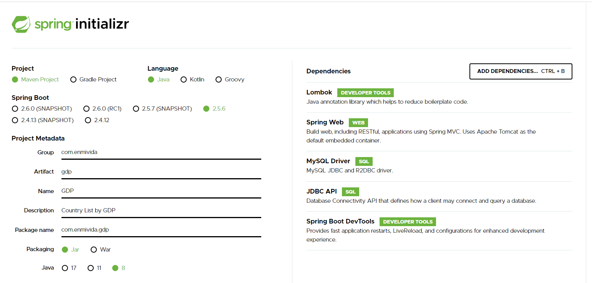

## Listado de países según el producto interior bruto

### Modelo de Base de datos



### Pantallazos

Country List



Country Detail



Country Edit



Country Add new city and language



### Spring initializr con data jdbc 



### Conexión con base de datos en properties

```properties
spring.datasource.url=jdbc:mysql://192.168.1.17:3306/world
spring.datasource.username=root
spring.datasource.password=adesiempre
```

